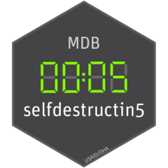

<!-- badges: start -->
[](https://github.com/USAID-OHA-SI/selfdestructin5/actions)
<!-- badges: end -->


# selfdestructin5 

SI utilities package to create Mission Director Briefers from MSDs

## Overview
The selfdestructin5 package is a convenient way to munge and create high quality tables for a select set of PEPFAR indicators. We created the package to automate the creation of quarterly Mission Director Tables that summarize a Missions performance across a subset of indicators. Focal users are SI staff who are tasked with creating, updating or modifying the Mission Director Briefer tables. 

### Installing `selfdestructin5`
selfdestructin5 is not on CRAN, so you will have to install it directly from Github using `remotes`.

If you do not have `remotes` installed, you will have to run the `install.packages("remotes")` line in the code below as well.

```{r}
## SETUP

  #install
    install.packages("remotes")
    remotes::install_github("USAID-OHA-SI/selfdestructin5")
    
  #load the package
    library(selfdestructin5)
  
  #List the functions contained in the package
    ls('package:selfdestructin5')
  
```

---

*Disclaimer: The findings, interpretation, and conclusions expressed herein are those of the authors and do not necessarily reflect the views of United States Agency for International Development. All errors remain our own.*
